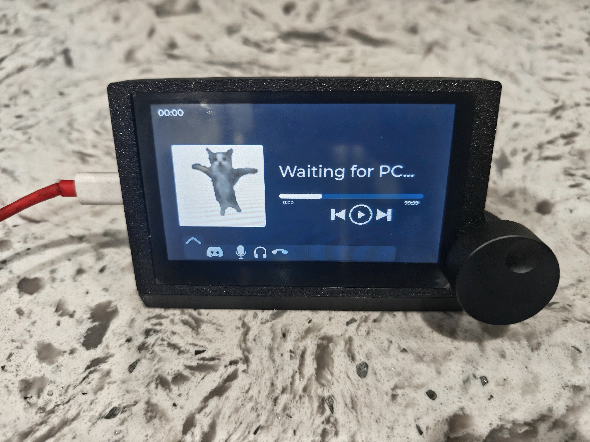

# ESP32 Media Player

A desktop-connected media controller built around an ESP32-S3 touchscreen display.

The project combines a Windows desktop companion with an ESP32 touchscreen to display current media information, album artwork, system audio state, and optional Discord voice-channel information while also providing physical and touchscreen media controls.

 <p align="center">
  
</p>
 
---

## Documentation

| Guide | Purpose |
| --- | --- |
| [Quick Start](docs/QUICK_START.md) | Get an assembled device running |
| [Bill of Materials](hardware/BOM.md) | Parts and reference purchase links |
| [Assembly Guide](hardware/ASSEMBLY.md) | Build the physical device |
| [3D Models](hardware/3d-models/) | Printable housing and stand |
| [Wiring Images](hardware/images/wiring/) | EC11 and CrowPanel pin references |

---

## Features

### Media Display

- Current track title and artist
- 250 × 250 album artwork
- Playback position and duration
- Dynamic interface colors derived from album artwork
- Current system time
- Windows volume level and mute state
- Play/pause synchronization
- Automatic reconnect when the display is unplugged and reconnected

### Physical Controls

The EC11 rotary encoder provides:

- **Rotate** — adjust Windows system volume
- **Single press** — play/pause
- **Double press** — mute/unmute Windows audio

### Touchscreen Controls

The touchscreen provides controls for:

- Play/pause
- Previous/next track
- Seeking
- Volume
- Media interaction
- Discord voice controls when Discord integration is enabled

### Discord Integration

Optional Discord integration can display and control:

- Current voice-channel name
- Voice-channel members
- User avatars
- Mute state
- Deafen state
- Voice-channel actions

The interface currently displays up to **15 voice-channel users** at once.

---

## How It Works

The project is split into two applications:

1. A **Windows desktop companion**
2. Firmware running on the **ESP32-S3 display**

The desktop companion retrieves information from Windows and Discord, then sends that state to the ESP32 over USB serial.

The ESP32 renders that information using LVGL and sends physical/touch control commands back to the Windows application.

```text
                         Windows PC
┌────────────────────────────────────────────────────────────┐
│                    Desktop Companion                       │
│                                                            │
│  Windows Media ──► media.py                                │
│                        │                                   │
│  Windows Audio ──► Pycaw                                   │
│                        │                                   │
│  Discord ────────► discord_client.py / network.py          │
│                        │                                   │
│                        ▼                                   │
│                    hardware.py                             │
│              serial framing + writer                       │
└───────────────────────────┬────────────────────────────────┘
                            │
                            │ USB Serial @ 230400 baud
                            ▼
┌────────────────────────────────────────────────────────────┐
│                         ESP32-S3                           │
│                                                            │
│                serial_protocol.cpp                         │
│                         │                                  │
│              ┌──────────┴──────────┐                       │
│              ▼                     ▼                       │
│     media_display.cpp       discord_ui.cpp                 │
│              │                     │                       │
│              ▼                     ▼                       │
│          Media UI              Discord UI                  │
│                                                            │
│   Touchscreen / Encoder ──► commands back to Windows       │
└────────────────────────────────────────────────────────────┘
```

---

## Quick Start

If you already have the hardware assembled, see the **[Quick Start Guide](docs/QUICK_START.md)**.

The recommended setup is:

1. Flash the ESP32 using the [**browser firmware installer**](https://infinitetimez.github.io/ESP32-Media-Player/).
2. Download the Windows companion executable from the GitHub Releases page.
3. Connect the display over USB.
4. Run the desktop companion.
5. Optionally enable Discord integration.

No Python or PlatformIO installation is required when using the prebuilt release files.

The easiest way to install the firmware is through the browser-based installer:

[**Flash the ESP32 Media Player Firmware**](https://infinitetimez.github.io/ESP32-Media-Player/)

The installer handles the required ESP32-S3 flash configuration automatically. No PlatformIO installation or manual flash addresses are required.

---

## Building the Hardware

Everything required to recreate the reference unit is included in the repository.

### Hardware Documentation

- **[Bill of Materials](hardware/BOM.md)**
- **[Hardware Assembly Guide](hardware/ASSEMBLY.md)**
- **[3D Models](hardware/3d-models/)**
- **[Wiring Images](hardware/images/wiring/)**

The included enclosure consists of:

- `Display_Housing_Print.stl`
- `Stand_Print.stl`

The reference prints were made using **PETG-HF**, although other suitable materials should also work.

The provided STL files are already oriented in the same orientation used for the reference prints.

### Reference Hardware

The main display used in the current build is the:

**ELECROW CrowPanel Advance 4.3" 800 × 480 ESP32 HMI Display**

[View the display on ELECROW](https://www.elecrow.com/crowpanel-advance-4-3-hmi-esp32-800x480-ai-display-ips-touch-artificial-intelligent-screen.html)

Additional reference parts, dimensions, quantities, and purchase links can be found in the **[Bill of Materials](hardware/BOM.md)**.

---

## EC11 Encoder Wiring

The firmware expects the following connections:

| EC11 Pin / Function | ESP32 Connection |
| --- | --- |
| A | GPIO 19 |
| B | GPIO 20 |
| C / Common | GND |
| Push switch | GPIO 8 |
| Remaining switch terminal | GND |

The two push-switch terminals are interchangeable.

If clockwise rotation decreases volume instead of increasing it, swap the **A** and **B** connections.

See the labeled wiring references in [`hardware/images/wiring/`](hardware/images/wiring/).

---

## Enclosure Notes

A few modifications are required when recreating the reference enclosure.

### Display Connector Clearance

The four beige connector housings on the display board are too large to fit inside the printed enclosure at their original height.

For the reference build, the connector housings were carefully trimmed to provide sufficient internal clearance.

Advanced builders may instead desolder the connectors and solder the required wiring directly to the PCB.

### Heat-Set Inserts

The enclosure uses **4 M3 heat-set inserts**.

For the PETG-HF reference print, approximately **270 °C** worked well when installing the inserts.

Too much heat can cause an insert to sink too quickly or damage nearby printed features, while too little heat can require excessive pressure and cause the surrounding plastic to bulge or warp.

See the **[Assembly Guide](hardware/ASSEMBLY.md)** for the full installation notes.

### Magnets

The housing and stand use **2 square magnets** measuring:

- 1.26 in × 1.26 in
- 2 mm thick

Orient the magnets so they attract when the stand and display housing are brought together.

The reference magnets include adhesive. Approximately **1 mm double-sided tape** can also be used if replacement adhesive is needed.

---

## Serial Protocol

Desktop-to-ESP32 application traffic uses a framed binary protocol:

```text
A5 5A | TYPE | uint32 LE LENGTH | PAYLOAD
```

Where:

- `A5 5A` is the frame synchronization marker
- `TYPE` identifies the packet
- `LENGTH` is a 32-bit little-endian payload length
- `PAYLOAD` contains the packet data

### Packet Types

| Type | Payload | Purpose |
| --- | --- | --- |
| `R` | None | ESP32 readiness |
| `T` | JSON | Track/media state |
| `I` | JPEG | Album artwork |
| `U` | JSON | Discord voice roster |
| `A` | Index + JPEG | Discord user avatar |
| `D` | State bytes | Discord mute/deafen state |
| `N` | Text | Discord voice-channel name |

The protocol was designed to recover from incomplete or corrupted serial data by allowing the firmware parser to search for the next valid frame boundary.

Large image packets are sent in smaller chunks to avoid overwhelming the ESP32 receive path.

---

## Reliability

USB serial communication ended up being one of the more important engineering parts of the project.

The current implementation includes:

- ESP32 readiness handshake
- Binary packet framing
- Packet type and length validation
- Serial parser state machine
- Stream resynchronization
- Stall detection
- Large-packet pacing
- Serialized desktop writes
- Automatic reconnect handling
- Latest-wins album-art delivery
- PSRAM-backed image buffers

These changes were introduced after early versions could occasionally display corrupted Discord labels or lose synchronization after pause/resume and reconnect events.

---

## Project Structure

```text
ESP32-Media-Player/
├── desktop-companion/
│   ├── main.py
│   ├── hardware.py
│   ├── media.py
│   ├── network.py
│   ├── discord_client.py
│   ├── config.py
│   ├── requirements.txt
│   └── ESP32-Media-Sync.spec
│
├── firmware/
│   ├── include/
│   │   ├── discord_ui.h
│   │   ├── media_display.h
│   │   ├── music_player_logic.h
│   │   ├── serial_protocol.h
│   │   └── ...
│   │
│   ├── src/
│   │   ├── main.cpp
│   │   ├── discord_ui.cpp
│   │   ├── media_display.cpp
│   │   ├── music_player_logic.c
│   │   ├── serial_protocol.cpp
│   │   └── generated UI files
│   │
│   └── platformio.ini
│
├── hardware/
│   ├── 3d-models/
│   │   ├── Display_Housing_Print.stl
│   │   └── Stand_Print.stl
│   │
│   ├── images/
│   │   └── wiring/
│   │
│   ├── ASSEMBLY.md
│   └── BOM.md
│
├── docs/
│   └── QUICK_START.md
│
├── README.md
├── LICENSE
└── .gitignore
```

---

## Firmware Architecture

### `main.cpp`

Responsible for:

- Display initialization
- LVGL initialization
- Touch input
- Rotary encoder input
- I2C controller setup
- Firmware module initialization
- Physical volume control
- Encoder button handling

### `serial_protocol.cpp`

Responsible for:

- UART packet framing
- Packet parser state machine
- Payload length parsing
- Packet validation
- Stream resynchronization
- Dispatching completed packets

### `media_display.cpp`

Responsible for:

- Track metadata updates
- Media UI synchronization
- Album JPEG decoding
- RGB565 conversion
- PSRAM-backed album-art buffers
- Album-art display updates

### `discord_ui.cpp`

Responsible for:

- Voice-channel roster
- Discord user cards
- Avatar decoding
- Avatar image buffers
- Voice-channel name
- Mute/deafen UI state

### `music_player_logic.c`

Responsible for:

- Player state
- Playback-position tracking
- Slider synchronization
- Time labels
- Play/pause visuals

---

## Desktop Companion

The Windows companion application handles communication between Windows, Discord, and the ESP32.

### `main.py`

Coordinates:

- Application startup
- Serial connection lifecycle
- Media synchronization
- Incoming ESP32 commands
- System-tray application behavior

### `hardware.py`

Handles:

- ESP32 discovery
- Serial connection
- Packet framing
- Outgoing write queue
- Album-art queue
- Large-packet pacing
- Reconnection

### `media.py`

Handles:

- Windows System Media Transport Controls
- Track metadata
- Playback state
- Album thumbnail retrieval
- Windows volume
- Windows mute state

### `network.py` / `discord_client.py`

Handle:

- Discord RPC
- Voice-channel state
- Voice roster synchronization
- Avatars
- Mute/deafen actions
- Discord voice controls

---

## Running From Source

Prebuilt releases are recommended for normal users.

Developers can run both components from source.

### Desktop Companion

Requirements:

- Windows
- Python 3
- Discord desktop client if using Discord integration

```powershell
cd desktop-companion

python -m venv .venv
.\.venv\Scripts\Activate.ps1

pip install -r requirements.txt
python main.py
```

### ESP32 Firmware

The firmware is built using PlatformIO.

```bash
cd firmware
pio run
```

Upload:

```bash
pio run --target upload
```

The firmware communicates with the desktop companion at **230400 baud**.

---

## Discord Setup

Discord integration is optional. The media player works normally without it.

To enable Discord features, you need to create a Discord application and enter its credentials into the desktop companion.

### 1. Create a Discord Application

Open the [Discord Developer Portal](https://discord.com/developers/applications) and sign in.

1. Click **New Application**.
2. Give the application a name, such as `ESP32 Media Player`.
3. Open the application after it is created.

### 2. Copy the Application ID

Open the application's **General Information** page.

Copy the **Application ID**.

For this project, the Application ID is used as the **Client ID**.

### 3. Copy the Client Secret

Open the **OAuth2** section of the Discord application.

Locate the **Client Secret** and copy it.

> Keep the Client Secret private. Do not commit it to GitHub or include it in screenshots.

### 4. Add the Redirect URI

In the application's **OAuth2** settings, add:

```text
http://127.0.0.1
```

---

## Releases

Prebuilt releases include:

- Windows desktop companion `.exe`
- Windows debug `.exe`
- merged ESP32 firmware image
- SHA-256 checksums
- source code

Normal users can install the ESP32 firmware using the [**browser firmware installer**](https://infinitetimez.github.io/ESP32-Media-Player/) without installing PlatformIO or the ESP32 development environment.

See the **GitHub Releases** page for available builds.

---

## Known Limitations

- The desktop companion currently supports Windows only.
- Firmware configuration is designed around the reference ELECROW display hardware.
- Discord integration requires the Discord desktop client.
- The Discord display supports up to 15 visible voice-channel users.
- Album artwork depends on thumbnail data supplied by the active Windows media application.
- Some physical modification of the display connector housings is required to fit the reference enclosure.

---


## Project Status

The ESP32 Media Player is currently on its first public release.

This was primarily a summer project, and since I'm a student, updates may be inconsistent depending on how busy I am. If you run into any issues, feel free to open one and I'll get to it when I can.

---

## License

Licensed under the GNU General Public License v3.0. See [`LICENSE`](LICENSE) for details.
