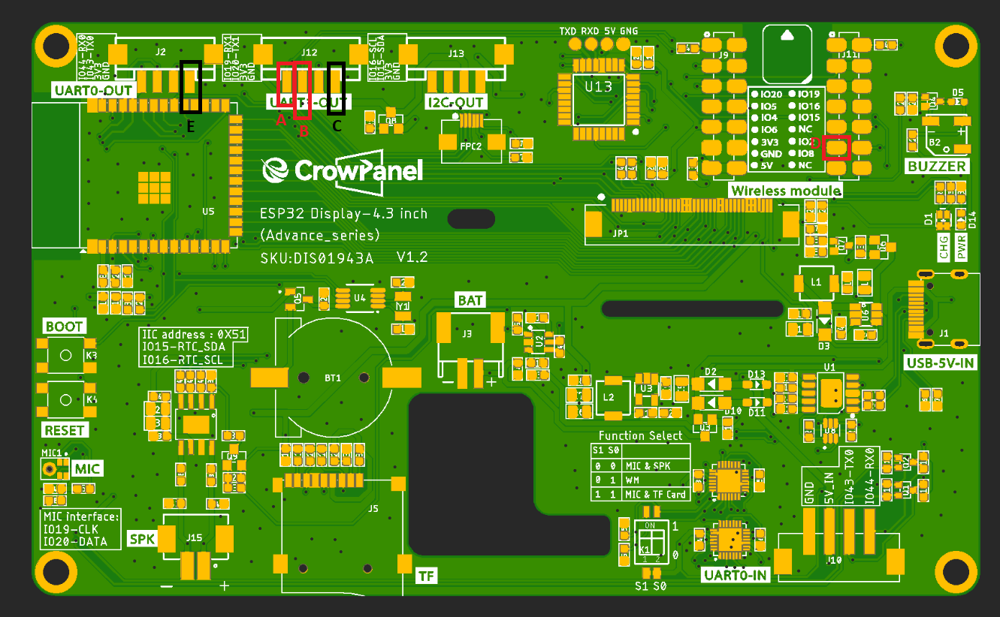
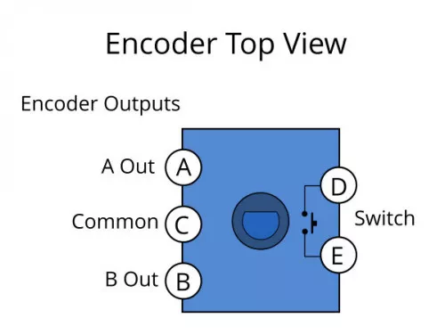

# Hardware Assembly Guide

This guide continues from the hardware overview in the main README and covers the reference ESP32 Media Player assembly.

For exact parts and purchase links, see the **[Bill of Materials](BOM.md)**.

## Tools

Recommended tools:

- Soldering iron
- Small Phillips screwdriver
- Flush cutters or hobby knife
- Heat-set insert tip or suitable soldering-iron tip
- Wire strippers
- Solder

## 1. Print the Enclosure

Print both files from [`3d-models/`](3d-models/):

- `Display_Housing_Print.stl`
- `Stand_Print.stl`

Reference print setup:

- **Material:** PETG-HF
- **Supports:** not required
- **Orientation:** the STL files are already oriented as used for the reference prints

Other suitable materials should also work, though support requirements may vary.

## 2. Prepare the Display Board

The four beige connector housings on the display board are too tall to fit inside the printed enclosure.

Carefully trim the housings until the board clears the inside of the case.

**Advanced alternative:** desolder the connector housings and wire directly to the PCB. This provides more clearance but carries a greater risk of damaging the board.

## 3. Install the Heat-Set Inserts

Install **4 M3 heat-set inserts**.

For PETG-HF, approximately **270 °C** worked well.

- Apply light, steady pressure.
- Allow the heat to soften the plastic rather than forcing the insert.
- Stop once the insert is flush.
- Let the plastic cool before installing screws.

Adjust the temperature as needed for the filament being used.

## 4. Install the Magnets

Use **2 square magnets** measuring:

- 1.26 in × 1.26 in
- 2 mm thick

Install one magnet in the housing and one in the stand. Dry-fit both parts first and verify that the magnets attract each other before attaching them permanently.

The reference magnets include adhesive. If you need replacement adhesive, use about **1 mm double-sided tape**. Thinner adhesive is better for a flush magnet fitment.
## 5. Wire the EC11 Encoder

| Encoder Pin / Function | ESP32 |
| --- | --- |
| A | GPIO 19 |
| B | GPIO 20 |
| C / Common | GND |
| D or E / Push switch | GPIO 8 |
| Remaining switch terminal | GND |

The two push-switch terminals are interchangeable.

> If clockwise rotation lowers volume instead of raising it, swap A and B.

## 6. Mount the Encoder and Knob

1. Secure the EC11 using its washer and nut.
2. Confirm the shaft rotates freely and the push action is unobstructed.
3. Install the 32 × 13 mm aluminum knob onto the 6 mm shaft.

## 7. Mount the Display

1. Confirm the trimmed connectors or direct wiring clear the enclosure.
2. Position the display without pinching any wires.
3. Check that internal wiring cannot short against the board.
4. Secure the display using the M3 hardware.

## 8. Flash and Test

Continue with the **[Quick Start Guide](../docs/QUICK_START.md)**.

Verify:

- Display boots
- Desktop companion connects
- Track information and album art update
- Encoder controls volume, play/pause, and mute
- Touchscreen controls work
- Discord UI updates correctly when enabled
